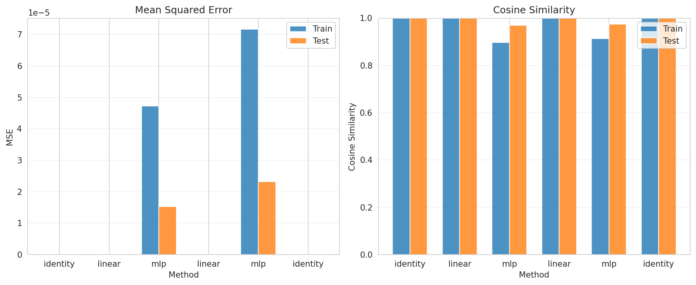

# Transferability Analysis Report

## Experiment Configuration

- **Train Concepts**: 8 (indices: [0, 1, 2, 3, 4, 5, 6, 7])
- **Test Concepts**: 2 (indices: [8, 9])
- **Total Experiments**: 6

## Summary Statistics

### All Methods Performance

| Transfer                                                                     | Method   |   Train MSE |    Test MSE |   Train Cosine |   Test Cosine |      MSE Gap |   Cosine Gap |
|:-----------------------------------------------------------------------------|:---------|------------:|------------:|---------------:|--------------:|-------------:|-------------:|
| gemma-2-2b-it-l20_to_gemma-2-2b-it-l20                                       | identity | 0           | 0           |       1        |      1        |  0           |  0           |
| gemma-2-2b-it-l20_to_meta-llama-Llama-3.1-8B-Instruct-l20                    | linear   | 1.70293e-08 | 2.74801e-08 |       0.999966 |      0.999947 |  1.04508e-08 |  1.91331e-05 |
| gemma-2-2b-it-l20_to_meta-llama-Llama-3.1-8B-Instruct-l20                    | mlp      | 4.72141e-05 | 1.52388e-05 |       0.897203 |      0.970053 | -3.19752e-05 | -0.0728503   |
| meta-llama-Llama-3.1-8B-Instruct-l20_to_gemma-2-2b-it-l20                    | linear   | 1.22156e-07 | 1.30803e-07 |       0.999871 |      0.999858 |  8.64722e-09 |  1.30534e-05 |
| meta-llama-Llama-3.1-8B-Instruct-l20_to_gemma-2-2b-it-l20                    | mlp      | 7.16191e-05 | 2.31995e-05 |       0.913078 |      0.974079 | -4.84196e-05 | -0.0610006   |
| meta-llama-Llama-3.1-8B-Instruct-l20_to_meta-llama-Llama-3.1-8B-Instruct-l20 | identity | 0           | 0           |       1        |      1        |  0           |  5.96046e-08 |

## Key Findings

### Best Methods

- **Lowest Test MSE**: identity (gemma-2-2b-it-l20_to_gemma-2-2b-it-l20) - MSE: 0.000000
- **Highest Test Cosine**: identity (gemma-2-2b-it-l20_to_gemma-2-2b-it-l20) - Cosine: 1.0000

### Generalization Analysis

- **mlp** (gemma-2-2b-it-l20_to_meta-llama-Llama-3.1-8B-Instruct-l20): Better on test than train (MSE gap: -0.000032)
- **mlp** (meta-llama-Llama-3.1-8B-Instruct-l20_to_gemma-2-2b-it-l20): Better on test than train (MSE gap: -0.000048)

## Detailed Metrics

### gemma-2-2b-it-l20_to_gemma-2-2b-it-l20 - identity

#### Train Set
- MSE: 0.000000
- Cosine Similarity: 1.0000 ± 0.0000
- L2 Distance: 0.0000 ± 0.0000
- Pearson Correlation: 1.0000
- Top-100 Overlap: 1.0000

#### Test Set
- MSE: 0.000000
- Cosine Similarity: 1.0000 ± 0.0000
- L2 Distance: 0.0000 ± 0.0000
- Pearson Correlation: nan
- Top-100 Overlap: 1.0000

### gemma-2-2b-it-l20_to_meta-llama-Llama-3.1-8B-Instruct-l20 - linear

#### Train Set
- MSE: 0.000000
- Cosine Similarity: 1.0000 ± 0.0000
- L2 Distance: 0.0080 ± 0.0025
- Pearson Correlation: 1.0000
- Top-100 Overlap: 0.9937

#### Test Set
- MSE: 0.000000
- Cosine Similarity: 0.9999 ± 0.0000
- L2 Distance: 0.0105 ± 0.0023
- Pearson Correlation: nan
- Top-100 Overlap: 0.9950

### gemma-2-2b-it-l20_to_meta-llama-Llama-3.1-8B-Instruct-l20 - mlp

#### Train Set
- MSE: 0.000047
- Cosine Similarity: 0.8972 ± 0.2079
- L2 Distance: 0.3438 ± 0.2932
- Pearson Correlation: 0.6035
- Top-100 Overlap: 0.7950

#### Test Set
- MSE: 0.000015
- Cosine Similarity: 0.9701 ± 0.0022
- L2 Distance: 0.2498 ± 0.0076
- Pearson Correlation: nan
- Top-100 Overlap: 0.8550

### meta-llama-Llama-3.1-8B-Instruct-l20_to_gemma-2-2b-it-l20 - linear

#### Train Set
- MSE: 0.000000
- Cosine Similarity: 0.9999 ± 0.0001
- L2 Distance: 0.0147 ± 0.0087
- Pearson Correlation: 1.0000
- Top-100 Overlap: 0.9925

#### Test Set
- MSE: 0.000000
- Cosine Similarity: 0.9999 ± 0.0001
- L2 Distance: 0.0160 ± 0.0096
- Pearson Correlation: nan
- Top-100 Overlap: 1.0000

### meta-llama-Llama-3.1-8B-Instruct-l20_to_gemma-2-2b-it-l20 - mlp

#### Train Set
- MSE: 0.000072
- Cosine Similarity: 0.9131 ± 0.1749
- L2 Distance: 0.3163 ± 0.2725
- Pearson Correlation: 0.6060
- Top-100 Overlap: 0.7638

#### Test Set
- MSE: 0.000023
- Cosine Similarity: 0.9741 ± 0.0021
- L2 Distance: 0.2311 ± 0.0085
- Pearson Correlation: nan
- Top-100 Overlap: 0.7950

### meta-llama-Llama-3.1-8B-Instruct-l20_to_meta-llama-Llama-3.1-8B-Instruct-l20 - identity

#### Train Set
- MSE: 0.000000
- Cosine Similarity: 1.0000 ± 0.0000
- L2 Distance: 0.0000 ± 0.0000
- Pearson Correlation: 1.0000
- Top-100 Overlap: 1.0000

#### Test Set
- MSE: 0.000000
- Cosine Similarity: 1.0000 ± 0.0000
- L2 Distance: 0.0000 ± 0.0000
- Pearson Correlation: nan
- Top-100 Overlap: 1.0000

## Visualization

