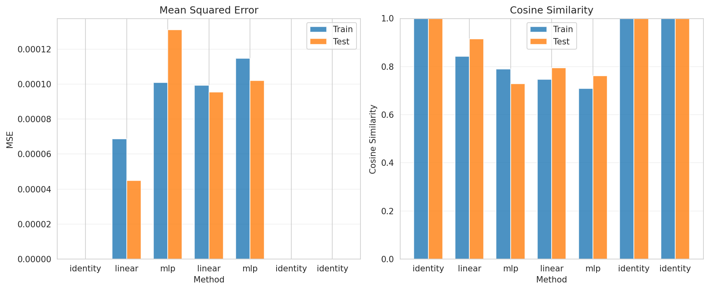

# Transferability Analysis Report

## Experiment Configuration

- **Train Concepts**: 40 (indices: [0, 1, 2, 3, 4, 5, 6, 7, 8, 9, 10, 11, 12, 13, 14, 15, 16, 17, 18, 19, 20, 21, 22, 23, 24, 25, 26, 27, 28, 29, 30, 31, 32, 33, 34, 35, 36, 37, 38, 39])
- **Test Concepts**: 10 (indices: [40, 41, 42, 43, 44, 45, 46, 47, 48, 49])
- **Total Experiments**: 7

## Summary Statistics

### All Methods Performance

| Transfer                                                                     | Method   |   Train MSE |    Test MSE |   Train Cosine |   Test Cosine |      MSE Gap |   Cosine Gap |
|:-----------------------------------------------------------------------------|:---------|------------:|------------:|---------------:|--------------:|-------------:|-------------:|
| gemma-2-2b-it-l20_to_gemma-2-2b-it-l20                                       | identity | 0           | 0           |       1        |      1        |  0           |    0         |
| gemma-2-2b-it-l20_to_gemma-2-9b-it-l30                                       | linear   | 6.86746e-05 | 4.49662e-05 |       0.842693 |      0.915452 | -2.37084e-05 |   -0.072759  |
| gemma-2-2b-it-l20_to_gemma-2-9b-it-l30                                       | mlp      | 0.000100984 | 0.000130989 |       0.79047  |      0.728377 |  3.00054e-05 |    0.0620928 |
| gemma-2-2b-it-l20_to_meta-llama-Llama-3.1-8B-Instruct-l20                    | linear   | 9.93698e-05 | 9.54255e-05 |       0.746826 |      0.794954 | -3.94433e-06 |   -0.0481288 |
| gemma-2-2b-it-l20_to_meta-llama-Llama-3.1-8B-Instruct-l20                    | mlp      | 0.00011472  | 0.000102069 |       0.709319 |      0.761951 | -1.26511e-05 |   -0.0526318 |
| gemma-2-9b-it-l30_to_gemma-2-9b-it-l30                                       | identity | 0           | 0           |       1        |      1        |  0           |    0         |
| meta-llama-Llama-3.1-8B-Instruct-l20_to_meta-llama-Llama-3.1-8B-Instruct-l20 | identity | 0           | 0           |       1        |      1        |  0           |    0         |

## Key Findings

### Best Methods

- **Lowest Test MSE**: identity (gemma-2-2b-it-l20_to_gemma-2-2b-it-l20) - MSE: 0.000000
- **Highest Test Cosine**: identity (gemma-2-2b-it-l20_to_gemma-2-2b-it-l20) - Cosine: 1.0000

### Generalization Analysis

- **linear** (gemma-2-2b-it-l20_to_gemma-2-9b-it-l30): Better on test than train (MSE gap: -0.000024)
- **linear** (gemma-2-2b-it-l20_to_meta-llama-Llama-3.1-8B-Instruct-l20): Better on test than train (MSE gap: -0.000004)
- **mlp** (gemma-2-2b-it-l20_to_meta-llama-Llama-3.1-8B-Instruct-l20): Better on test than train (MSE gap: -0.000013)

## Detailed Metrics

### gemma-2-2b-it-l20_to_gemma-2-2b-it-l20 - identity

#### Train Set
- MSE: 0.000000
- Cosine Similarity: 1.0000 ± 0.0000
- L2 Distance: 0.0000 ± 0.0000
- Pearson Correlation: 1.0000
- Top-100 Overlap: 1.0000

#### Test Set
- MSE: 0.000000
- Cosine Similarity: 1.0000 ± 0.0000
- L2 Distance: 0.0000 ± 0.0000
- Pearson Correlation: 1.0000
- Top-100 Overlap: 1.0000

### gemma-2-2b-it-l20_to_gemma-2-9b-it-l30 - linear

#### Train Set
- MSE: 0.000069
- Cosine Similarity: 0.8427 ± 0.2551
- L2 Distance: 0.3851 ± 0.3167
- Pearson Correlation: 0.6233
- Top-100 Overlap: 0.7555

#### Test Set
- MSE: 0.000045
- Cosine Similarity: 0.9155 ± 0.1199
- L2 Distance: 0.3218 ± 0.2530
- Pearson Correlation: 0.8180
- Top-100 Overlap: 0.8000

### gemma-2-2b-it-l20_to_gemma-2-9b-it-l30 - mlp

#### Train Set
- MSE: 0.000101
- Cosine Similarity: 0.7905 ± 0.3875
- L2 Distance: 0.4745 ± 0.3745
- Pearson Correlation: 0.2138
- Top-100 Overlap: 0.7620

#### Test Set
- MSE: 0.000131
- Cosine Similarity: 0.7284 ± 0.4970
- L2 Distance: 0.5313 ± 0.4560
- Pearson Correlation: -0.0190
- Top-100 Overlap: 0.7530

### gemma-2-2b-it-l20_to_meta-llama-Llama-3.1-8B-Instruct-l20 - linear

#### Train Set
- MSE: 0.000099
- Cosine Similarity: 0.7468 ± 0.3798
- L2 Distance: 0.5738 ± 0.2825
- Pearson Correlation: 0.5031
- Top-100 Overlap: 0.6737

#### Test Set
- MSE: 0.000095
- Cosine Similarity: 0.7950 ± 0.1727
- L2 Distance: 0.5897 ± 0.2189
- Pearson Correlation: 0.5317
- Top-100 Overlap: 0.6430

### gemma-2-2b-it-l20_to_meta-llama-Llama-3.1-8B-Instruct-l20 - mlp

#### Train Set
- MSE: 0.000115
- Cosine Similarity: 0.7093 ± 0.4470
- L2 Distance: 0.5834 ± 0.3646
- Pearson Correlation: 0.2336
- Top-100 Overlap: 0.6880

#### Test Set
- MSE: 0.000102
- Cosine Similarity: 0.7620 ± 0.2472
- L2 Distance: 0.5843 ± 0.2918
- Pearson Correlation: 0.4584
- Top-100 Overlap: 0.6470

### gemma-2-9b-it-l30_to_gemma-2-9b-it-l30 - identity

#### Train Set
- MSE: 0.000000
- Cosine Similarity: 1.0000 ± 0.0000
- L2 Distance: 0.0000 ± 0.0000
- Pearson Correlation: 1.0000
- Top-100 Overlap: 1.0000

#### Test Set
- MSE: 0.000000
- Cosine Similarity: 1.0000 ± 0.0000
- L2 Distance: 0.0000 ± 0.0000
- Pearson Correlation: 1.0000
- Top-100 Overlap: 1.0000

### meta-llama-Llama-3.1-8B-Instruct-l20_to_meta-llama-Llama-3.1-8B-Instruct-l20 - identity

#### Train Set
- MSE: 0.000000
- Cosine Similarity: 1.0000 ± 0.0000
- L2 Distance: 0.0000 ± 0.0000
- Pearson Correlation: 1.0000
- Top-100 Overlap: 1.0000

#### Test Set
- MSE: 0.000000
- Cosine Similarity: 1.0000 ± 0.0000
- L2 Distance: 0.0000 ± 0.0000
- Pearson Correlation: 1.0000
- Top-100 Overlap: 1.0000

## Visualization

